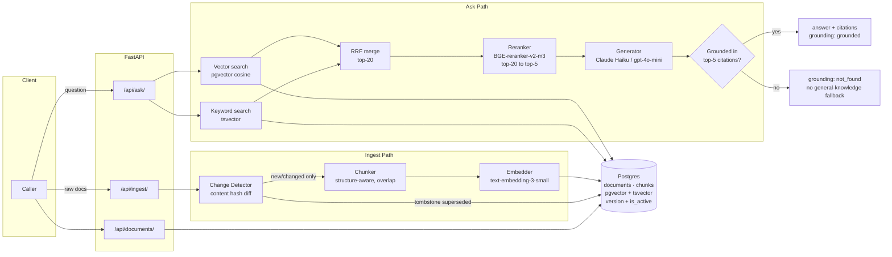
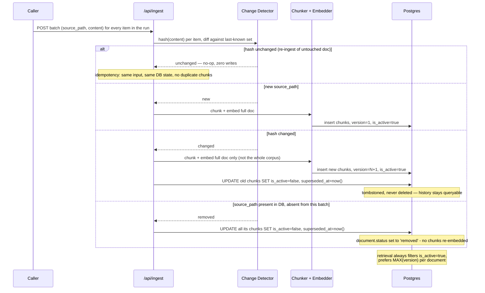
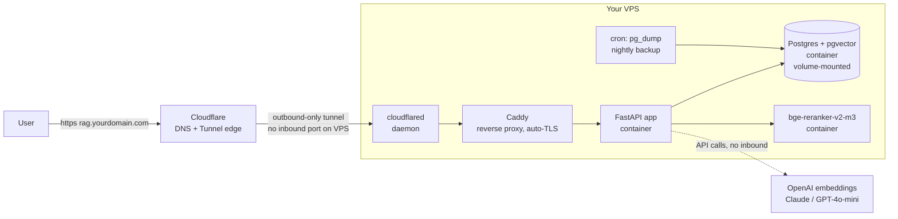

# Stage 7 — Retrieval-Grounded Answering with Citations

### Mini Technical Requirements Document

Corpus: OWASP Cheat Sheet Series (identity, access, input-handling), pinned per [`CORPUS.md`](CORPUS.md). 40 indexed docs, 7 held-out (abstention), 1 freshness-revision pair — see [`../scripts/fetch_corpus.sh`](../scripts/fetch_corpus.sh).

## 1. Scope

Three endpoints — `POST /api/ingest`, `GET /api/documents`, `GET /api/ask` — plus a freshness sub-system (idempotent re-ingest, change detection, incremental re-embed, chunk versioning/tombstoning) and a 25-question eval harness. No answer is ever generated without retrieval having run; the model must abstain (`grounding: "not_found"`) when the corpus doesn't support the question.

## 2. Stack

| Layer | Choice | Why |
| --- | --- | --- |
| Store | Postgres + `pgvector` + `tsvector`, **self-hosted in Docker on the VPS** | Vector, keyword and relational metadata in one transactional store — versioning/tombstoning needs that atomicity. Self-hosted because the VPS is already a sunk cost; a managed free tier buys nothing extra and adds a storage cap. |
| Embeddings | OpenAI `text-embedding-3-small` | Cheap ($0.02/M tok), corpus is ~160k tokens → pennies total. No GPU on the VPS to self-host this cheaply anyway. |
| Reranker | `BGE-reranker-v2-m3`, self-hosted | Free, CPU-capable at this batch size (top-20 → top-5); now just another container on the same box. |
| Generation | Claude Haiku 4.5 / GPT-4o-mini | Cheap, reliable at "answer only from context, else refuse." Kept as an API call — a budget VPS has no GPU to serve this well locally. |
| API | Python + FastAPI | Retrieval and generation kept as separable modules, per §7.4. |
| Reverse proxy | Caddy | Auto-HTTPS via Let's Encrypt, minimal Caddyfile, sits in front of FastAPI. |
| Edge / DNS | Cloudflare Tunnel (`cloudflared`) | Outbound-only connection from VPS to Cloudflare — no inbound port ever opened, origin IP stays hidden. Free. |

## 3. System architecture



## 4. Ingestion & freshness (graded sub-system, §7.3)

A stale answer gives no visual signal that anything is wrong — unlike a hallucination, which sometimes reads as obviously off. "Correct last month" looks identical to "correct now." That's why this is graded as its own sub-system rather than folded into ingestion-as-plumbing: idempotency, change detection and tombstoning are the only things standing between a silent drift and a demo that still looks perfect.



**Idempotency test:** re-run `POST /api/ingest` on an unchanged batch twice; `chunks` row count must not move. **Incremental-only test:** change one document in a 40-doc batch; only that document's chunks get new embeddings — assert on embedding-call count, not just wall-clock time, since that's the number §7.3 says a full reindex fails without justifying.

## 5. Data model (sketch)

```
documents(id, source_path, content_hash, latest_version, ingested_at, status)
chunks(id, document_id, version, chunk_index, content, token_count,
       embedding vector(1536), tsv tsvector, is_active bool,
       created_at, superseded_at)
```

`is_active` + `version` are what §7.3 grades: superseded chunks stay queryable for audit but never surface in retrieval.

## 6. Key decisions

- **Hybrid, not vector-only.** The corpus is dense with header names, error codes and flag literals (`SameSite`, `X-Frame-Options`) that embeddings under-weight — BM25 via `tsvector` recovers exact-token matches, merged with vector similarity via RRF.
- **Reranker is a real cross-encoder**, not an LLM call, to keep the ask-path cheap and to have a component whose precision/recall is independently testable.
- **Abstention is structural, not a prompt request.** The 7 held-out documents (`Secrets_Management`, `Key_Management`, etc.) share vocabulary with indexed docs, so retrieval will look confident — the generator only answers if the reranked top-5 actually supports the claim; otherwise `not_found`.

## 7. Deployment (self-managed VPS)



- `docker-compose.yml` bundles `app`, `postgres`, `reranker`, `caddy`, `cloudflared` with `restart: always`, so a VPS reboot recovers the whole stack without manual intervention.
- Cloudflare DNS: a `CNAME` for the subdomain pointed at the tunnel — no `A` record to the VPS's IP, so the origin is never directly reachable.
- Backups are now your responsibility: nightly `pg_dump` to the VPS disk (and ideally off-box, e.g. Cloudflare R2 or Backblaze B2) since there's no managed-provider snapshot safety net.

## 8. Minimal client

**htmx + Jinja2 templates, served by the same FastAPI app** — two new routes (`GET /` and partial-render endpoints), no build step, no extra container, no separate deploy target. Fits the VPS deployment in §7 with zero marginal cost or complexity.

Screens, each mapped to a graded requirement rather than decoration:

| Screen | Backed by | Proves |
| --- | --- | --- |
| Ask panel | `GET /api/ask` | Answer + citations (`source`, `chunk_id`, `version`, `snippet`) with a visible `grounded` / `not_found` badge — abstention behavior live, not just in the eval report. |
| Documents table | `GET /api/documents` | Source, version, `ingested_at` — the freshness metadata §7.3 requires surfaced. |
| Freshness before/after | `GET /api/ask` against two ingest states | Same question, citation `version` visibly different pre/post update — the clickable form of the written freshness demo. |
| Re-ingest trigger | `POST /api/ingest` | Renders change-detection counts (`new`/`changed`/`unchanged`/`removed`) back — proves incremental re-embed, not a full reindex. |
| Eval summary | static render of the eval JSON | Precision@k/recall@k, faithfulness rate, abstention accuracy as a table — the actual grade, not just a demo. |

## 9. Out of scope for this stage

- Multi-tenant auth — single corpus, no per-user ACLs.
- Cross-encoder fine-tuning — off-the-shelf `bge-reranker-v2-m3` only.
- Streaming responses (that's Stage 10's concern).
